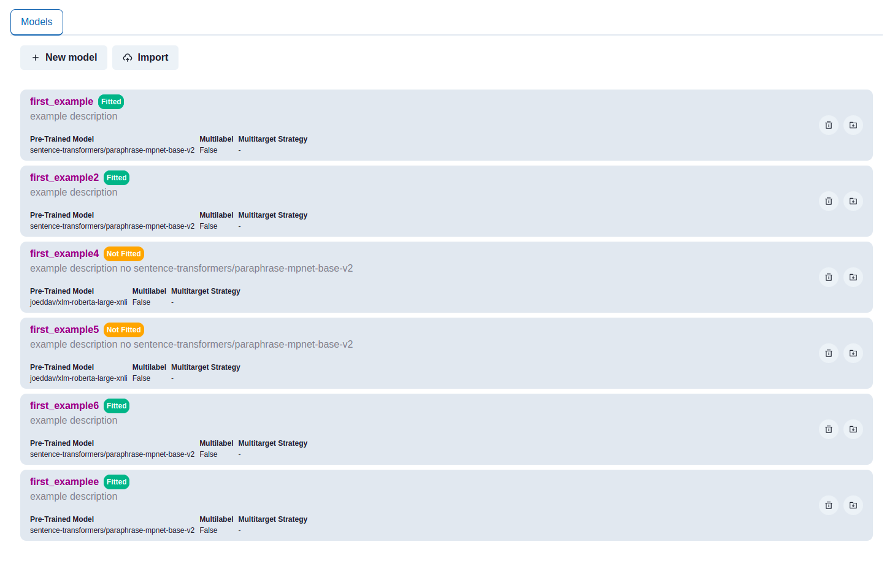
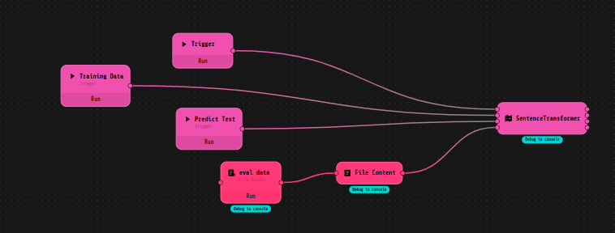
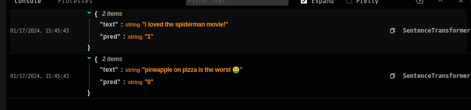
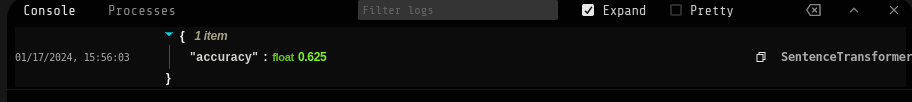

# Loko Sentence Transformer


This LOKO AI extensions offers the possibility to use the SentenceTransformer component, which gives the possibility to use the SetFit model of HuggingFace. 
As stated in the [HuggingFace documentation](https://huggingface.co/docs/setfit/index):
 
>SetFit is an efficient and prompt-free framework for few-shot fine-tuning of Sentence Transformers. It achieves high accuracy with little labeled data - for instance, with only 8 labeled examples per class on the Customer Reviews sentiment dataset.


## How to use it


The SentenceTransformer component can be used as the LOKO AI Predictor. Thus, you can create a model, train it (or rather to say, fine-tune it) and use it to predict the class of a new sentence. In order to **create** a model it's possible to use the GUI, or directly the component. You only need to choose and specify the model you want to use, and the name.



To train the model, you need to link to the "**Fit**" input pin the training dataset, and then specify the parameter's value inside the component. Below it's possible to see an example flow, in which we used a Trigger component to store the data and start the training process. 




The training dataset as a specific format, which is shown here below. It's a JSON file, in which the keys are "idx", "sentence" and "label". The last two labels can be customized based on the data used. The "idx" key contains the index of the sentence, the "sentence" key contains the sentence itself, and the "label" key contains the label of the sentence (in this case 0 or 1).

```json
{
  "idx": [
    32326,
    27449,
    60108,
    23141,
    35226,
    66852,
    65093,
    47847,
    39440,
    56428,
    6798,
    6824,
    56503,
    51288,
    39024,
    58847
  ],
  "sentence": [
    "klein , charming in comedies like american pie and dead-on in election , ",
    "be fruitful ",
    "soulful and ",
    "the proud warrior that still lingers in the souls of these characters ",
    "covered earlier and much better ",
    "wise and powerful ",
    "a powerful and reasonably fulfilling gestalt ",
    "smart and newfangled ",
    "it too is a bomb . ",
    "guilty about it ",
    "while the importance of being earnest offers opportunities for occasional smiles and chuckles ",
    "stevens ' vibrant creative instincts ",
    "great artistic significance ",
    "what does n't this film have that an impressionable kid could n't stand to hear ? ",
    "working from a surprisingly sensitive script co-written by gianni romoli ... ",
    "eight crazy nights is a total misfire . "
  ],
  "label": [
    1,
    1,
    1,
    1,
    0,
    1,
    1,
    1,
    0,
    0,
    1,
    1,
    1,
    1,
    1,
    0
  ]
}
```

Eventually the data can also have another level of nesting, using the keys "train_dataset" and "eval_dataset" to perform in the same time the training and the evaluation of the model.

The parameters that can be specified are:
- Textuale feature name: the name of the feature that contains the text to be classified. Default value: "sentence"
- Label feature name: the name of the feature that contains the label of the text. Default value: "label"
- Loss Function to use, that can be chosen between several options. Default value: "CrossSimilarityLoss"
- Metric to compute, that can be set among the classical classification performance metrics. Default value: "accuracy"
- Batch size: the batch size to use during the training. Default value: 16
- Number of iterations: the number of iterations to use during the training. Default value: 10
- Number of epochs: the number of epochs to use during the training. Default value: 1


Once the model is trained, it can be used to predict the class of a new sentence. The input data can be a list of strings, representing the sentences to be classified. The output data will be a list of integers, representing the class of the sentences.





In case you didn't evaluate the model when you trained it, you can do it now. You only need to link the evaluation dataset to the "**Evaluate**" input pin. The evaluation dataset has the same format as the training dataset, and the output will be the evaluation metrics specified in the component.





## Configuration


Don't forget to add your HuggingFace token to the config.json file, in place of the placeholder _<insert-your-token-here>_. 


```json
{
  "main": {
    "gui": {
      "name": "Sentence Transformer GUI"
    },
    "volumes": [
        "/var/opt/huggingface:/root/.cache/huggingface",
        "/var/opt/torch:/root/.cache/torch",
        "/var/opt/loko/loko-sentence-transformer/repo:/plugin/repo"
    ],
    "environment": {
      "HF_TOKEN": "<insert-your-token-here>"
    }
  }
}
```

